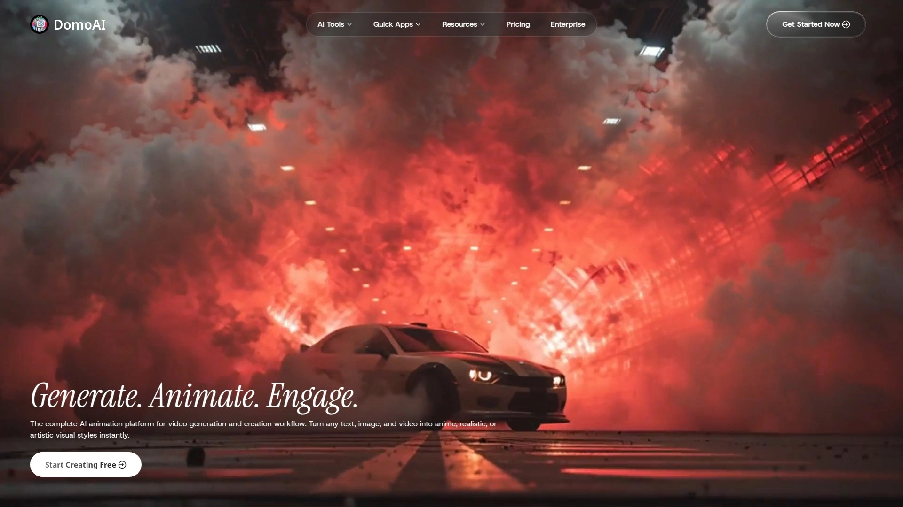
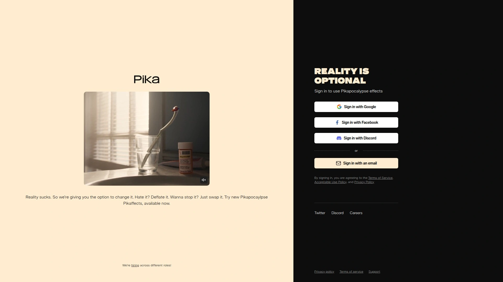
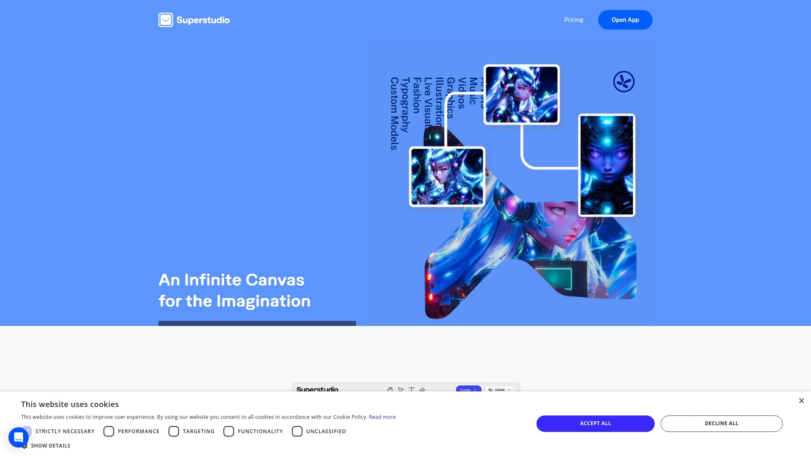
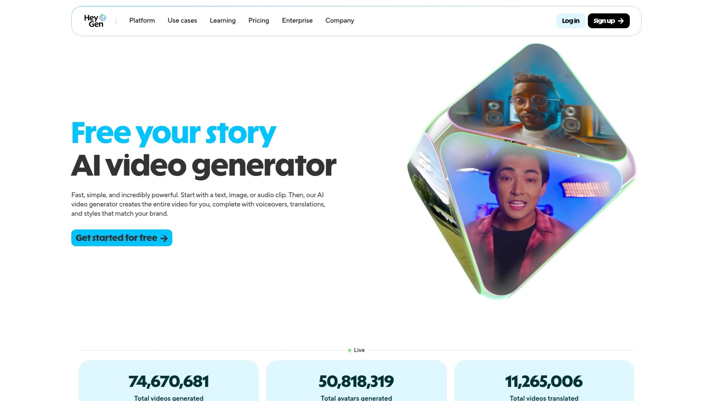
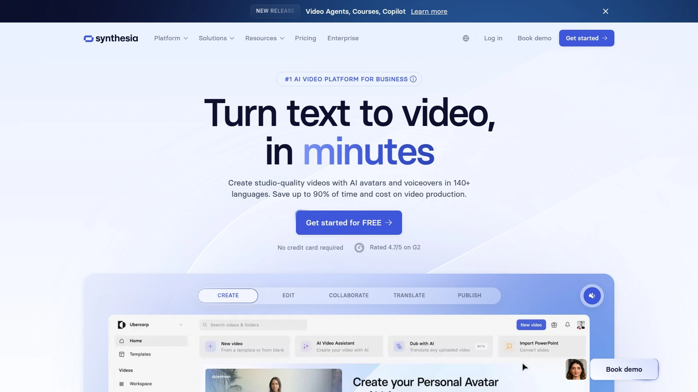
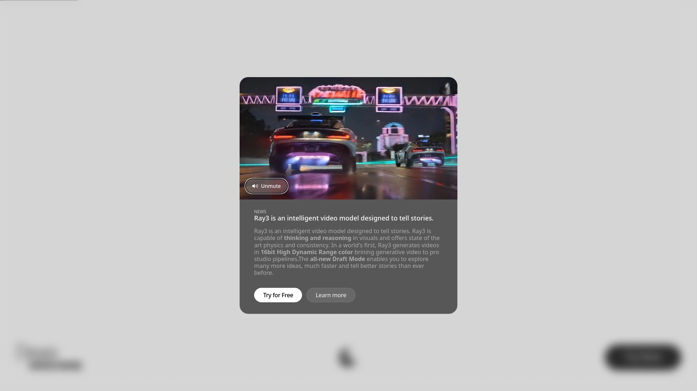
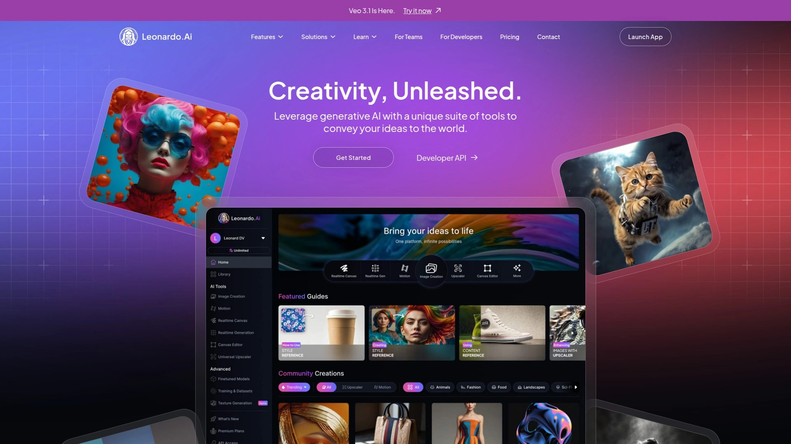
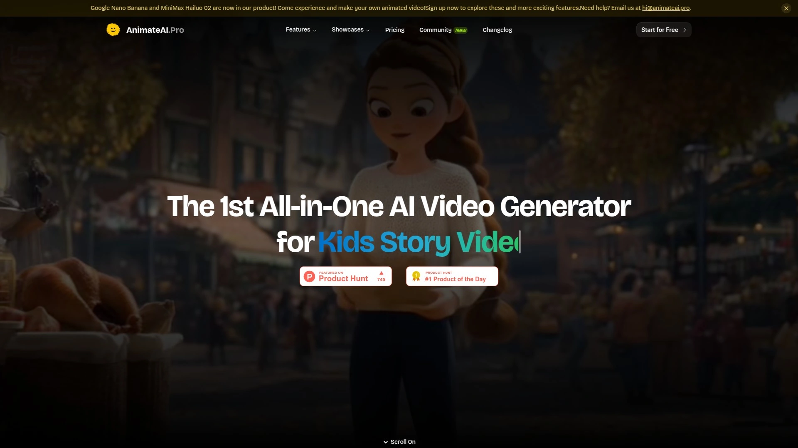
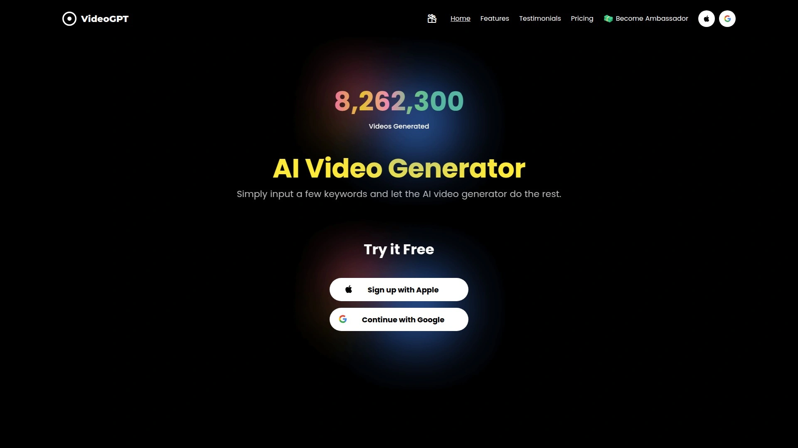

# Top 11 Best AI Video Generation Tools in 2025

Manual video production burns through budgets hiring editors, animators, and voice actors while projects drag on for weeks, but tight deadlines and limited resources demand faster output without sacrificing quality. AI video generators solve this bottleneck by transforming text prompts, static images, or rough footage into polished videos within minutes, democratizing content creation for solo creators and enterprises alike. The challenge is finding platforms that balance generation speed, output quality, style flexibility, and fair pricing without hidden usage caps. These tools handle everything from anime style transfers to realistic talking avatars, turning creative concepts into shareable content before momentum fades.

---

## **[DomoAI](https://domoai.app)**

Complete AI animation platform converting text, images, and videos into anime, realistic, or artistic styles with smart editing tools handling complex tasks automatically.

DomoAI positions itself as the comprehensive creative studio covering every step from concept to finished video through one interface. The platform handles video-to-video transformation, image-to-video animation, talking avatars, character animation, and text-to-video generation without switching between tools. Users upload footage and instantly convert it to anime-style scenes using the AI Anime Video Generator, eliminating manual frame-by-frame animation work.

Smart editing features save hours on tedious tasks like upscaling resolution, removing backgrounds without green screens, matching lip sync automatically, and controlling motion precisely. The Motion & Style Reference tool lets you upload reference videos to transfer dance moves or custom styles directly onto your footage. Background Removal uses Screen Keying or Subject-only mode for precise control without physical backdrops. Video Upscaler enhances resolution and quality using AI technology to improve clarity and detail.

Ready-to-use creative suites provide quick access to stylized content with zero setup complexity. Cartoonize Video Object converts real footage into cartoon-style animations while AI Video Style Transfer applies custom art styles based on text or image references. Text-to-Image generates stunning visuals from any prompt, and AI Image Upscaler enhances images to 4K resolution. The AI Video Lip Sync feature stands out as a game-changer for content creators enhancing video realism and engagement.

Users appreciate the time efficiency significantly reducing hours required for high-quality visual content creation. The user-friendly interface ensures seamless experiences even for beginners exploring advanced features. Cost-effective subscription plans suit different budgets making advanced AI tools accessible. Creative control provides extensive customization options allowing users to fine-tune creations matching their exact vision. Best for content creators wanting all-in-one video animation capabilities without learning multiple specialized applications.

***

## **[Runway ML](https://runwayml.com)**

Industry-leading AI video platform trusted by millions worldwide delivering high-fidelity motion with text-to-video, image-to-video, and advanced editing features for professional creators.

Runway ML delivers professional-grade video generation allowing creators to produce stunning content with minimal effort. The platform offers models like Runway Gen 3 Alpha and Runway Gen 4 Turbo providing exceptional detail, realistic motion, and enhanced prompt adherence ensuring messages convey effectively across applications. Gen-4 pushes ultra-realism with cinematic quality and detailed physics simulations while Gen-3.5 Turbo prioritizes speed with stylized realism.

Character consistency remains stable across various scenes and lighting conditions using single reference images to maintain identity throughout videos. This feature proves crucial for storytelling allowing seamless transitions and coherent narratives whether creating short films or promotional videos. Enhanced prompt adherence means the AI responds accurately to user specifications requiring fewer iterations and faster production times. Dynamic camera motion creates natural parallax and cinematic feel in Gen-4 while simpler pans and zooms characterize Gen-3.5.

Transform both images and text into eye-catching motion by animating photos, artwork, or product visuals with natural depth and movement. Start from text prompts describing desired scenes or actions to generate high-impact video content. The platform excels for high-end advertisements, film pre-visualization, and realistic storytelling where quality matters most. Forrester Consulting research shows Runway provides significant ROI with improved message delivery rates.

Users note Gen-4 can cost approximately $12 for less than one minute of video reflecting premium positioning. The platform works exceptionally well for image reference and video-to-video transformations with slightly higher odds of success compared to earlier generations. Best for professional video creators and agencies prioritizing cinematic quality and precise creative control over budget constraints.

***

## **[Pika Labs](https://pika.art)**

Idea-to-video platform with Pika 2.0 enhanced rendering, cinematic effects, and customizable camera movements transforming text prompts and images into dynamic content.

Pika Labs developed Pika AI as a cutting-edge platform using advanced artificial intelligence to create high-quality engaging videos from text prompts and images. Designed for creators, marketers, and educators, Pika offers intuitive tools turning ideas into stunning visuals effortlessly whether for social media, advertisements, or personal projects. Pika 2.0 introduces advanced video rendering, cinematic effects, and improved processing speeds ensuring top-notch quality in fractions of traditional time.

Text-to-video generation interprets prompts seamlessly to match your vision making it ideal for marketing campaigns, storytelling, and tutorials. Image-to-video animation brings static images to life with customizable effects and transitions. Multistyle video options include cinematic, animated, or realistic modes adapting to project needs. Customizable effects and camera movements add creative zoom-ins, transitions, or visual effects with precise control making content stand out.

Creation process starts by heading to public creation channels and initiating direct messages with the pikabot. Type /create to kickstart video creation then input prompts in the chat box and send to generate desired videos. Optionally upload reference images for Pika to use as initial frames. Parameter settings include frames per second for smoother videos, motion intensity from one to four, and aspect ratio modifications. Camera features add depth with pan movements, zoom controls, and rotation effects creating visually engaging experiences.

The platform handles content creation for influencers, YouTubers, and social media managers producing scroll-stopping content. Marketing and advertising teams generate promotional videos easily for product launches or brand awareness campaigns. Education professionals develop informative explainer videos or e-learning modules. Best for creators prioritizing fast turnaround on stylized video content without expensive production equipment or teams.

***

## **[Kaiber AI](https://kaiber.ai)**

Audio-reactive video generation engine transforming text, images, and music into dynamic visual stories with storyboard sequencing and artistic style transfers.

Kaiber AI empowers artists and creators to transform ideas into captivating visual content through advanced generative AI technology. Whether you're a musician seeking dynamic music videos or a visual artist exploring new creative avenues, Kaiber offers intuitive tools bringing visions to life. Superstudio launched in October 2024 provides a unified space where human imagination seamlessly integrates with machine intelligence.

Text-to-video generation converts textual descriptions into engaging video narratives allowing seamless storytelling without advanced technical skills. Audioreactivity synchronizes visuals with audio elements enabling creation of dynamic videos responding to music or voiceovers enhancing viewer engagement. Customizable animations adjust camera movements, scene transitions, and overall video flow to craft unique tailored productions aligning with creative vision. Video upscaling enhances resolution up to 1080p or 4K ensuring high-quality outputs suitable for various professional applications.

Artistic style transfer experiments with diverse aesthetics applying unique looks to videos making content visually distinctive. Storyboard sequencing plans and organizes multiple scenes in logical sequence ensuring smooth narrative flow for complex projects. The platform supports multiple media types integrating images, videos, and audio files for dynamic immersive creations. Luma Video Flow generates smooth five-second videos using Luma Lab's Dream Machine model perfect for short high-quality animations.

Video Lab Flow animates images, visualizes text prompts, and creates unique audioreactive animations syncing with audio making it powerful for animated visuals with creative edge. Video Restyle Flow applies new aesthetics to existing videos using descriptive text prompts creating visually distinctive content. The mobile app is loved by 60,000+ creatives turning text, videos, photos, and music into stunning AI animations in minutes. Best for musicians creating music videos and visual artists wanting audio-reactive content synchronized perfectly with soundtracks.

***

## **[HeyGen](https://www.heygen.com)**

AI-powered avatar platform creating hyper-realistic talking videos from text, photos, or voice with multilingual support and automatic lip-syncing across 140+ languages.

HeyGen launched in 2020 as an AI-powered video creation platform helping users produce videos using AI-generated avatars, multilingual voiceovers, and automatic video translation with lip-syncing. You simply upload scripts or write directly in the app and HeyGen turns content into videos featuring realistic avatars reading your message. No filming, hiring actors, or editing software required making video creation accessible.

Create Your Digital Twin by recording short videos of yourself to generate personalized avatars mirroring your look and expressions. Design with AI using text prompting to describe desired styles letting AI create avatars without studios. Build from Photos by uploading images to create lifelike avatars in minutes. The latest HeyGen Avatar IV turns single images into captivating talking videos with ultra-realistic natural-looking results.

Video Creation Shortcuts and Video Agent provide new ways to make videos faster than ever with AI avatars creating lifelike content 24/7. The avatars look super realistic with spot-on lip sync and expressions requiring no tech skills. Input text and have avatars speak seamlessly with voice-to-avatar animation using recordings or text-to-speech with AI voices. Multilingual capabilities span 140+ languages connecting with global audiences effortlessly.

HeyGen integrates with Canva turning scripts into talking videos with customizable AI avatars for designs in minutes demonstrating astounding simplicity, efficiency, and quality. Camera shy entrepreneurs, solopreneurs unable to afford continuous video production, and marketers tired of filming themselves constantly benefit most. The platform proves ideal for training videos, product demonstrations, social media content, and marketing campaigns requiring consistent presenter presence. Best for businesses needing scalable video production with realistic avatars without ongoing filming costs or talent scheduling.

***

## **[Synthesia](https://www.synthesia.io)**

Number one AI video platform for business creating professional videos from text with 140+ languages, expressive avatars, and one-click updates syncing automatically.

Synthesia is the AI-powered video generation platform helping users create professional-looking videos without cameras, actors, or studios using deep learning to generate realistic AI avatars. Founded in 2017 and based in London, the company developed technology allowing text-to-video creation eliminating need for traditional production. Users input scripts, select avatars and voices, then AI generates fully synthesized videos with realistic lip-syncing.

Your AI Avatar speaks 140+ languages fluently with uncanny expressiveness while you keep full control. Automatically transform existing documents, links, or ideas into AI videos matching your brand style instantly. Collaborate with teams in real-time creating, commenting, and reviewing AI videos in one place. Translate any video in 140+ languages saving hours of work and thousands in production with perfectly synced lip movements.

Create polished screen recordings in one take with instant transcripts without filler words then edit, update, and translate instantly. Upload logos, choose colors, and set styles making every video precisely on-brand. Update AI videos with one-click avoiding broken links or duplicate files with every version syncing automatically to originals. Export videos in SCORM format for any learning management system easily keeping them updated.

The platform is widely used in corporate training, e-learning, marketing, and internal communications helping businesses create professional-quality videos without expensive filming equipment or editing skills. Over sixty percent of Fortune 100 companies use Synthesia as of January 2025. Optimize every video with powerful analytics tracking views, drop-offs, and completion rates. Best for enterprises prioritizing scalable multilingual training content and corporate communications requiring frequent updates with consistent branding.

***

## **[D-ID](https://www.d-id.com)**

Creative Reality studio turning still images into speaking digital people in seconds with 120 languages, customizable voices, and instant MP4 video generation.

D-ID's Creative Reality studio AI video generator mobile app creates AI videos of digital people from single images quickly and easily. The platform brings still images to life transforming them into talking avatars using text-to-video animation technology. Choose digital persons by tailoring avatars with faces matching your vision from built-in photorealistic or illustrated libraries or upload your own images.

Speak any language connecting with global audiences by creating videos of digital persons speaking in 120 languages. Create anywhere you go with the power of text-to-video animation in the palm of your hand through mobile apps. AI Video Magic serves as your creative companion transforming text and images into videos with talking avatars. Instant Animation brings avatars to life with videos making them shine with charisma and charm.

Personalize Speech by customizing AI avatar voices effortlessly through uploaded voice recordings or text-to-speech determining what digital persons say. With single clicks you have MP4 AI videos ready to use. Turn avatars into stars, craft talking collectibles, integrate them into interactive games, enhance presentations, or infuse chatbots with unforgettable user experiences. The platform works on iOS and Android providing consistent mobile-first creation capabilities.

Effortless creation makes content accessible for marketers, educators, and content creators without technical video production skills. The tool excels at creating personalized video messages, animated presentations, social media content, and customer-facing communications requiring human-like presenters. D-ID prohibits use for creating non-consensual clones including celebrities or political figures for satirical purposes requiring explicit consent and strict pre-screening. Best for mobile-first creators and businesses needing quick personalized video messages with realistic talking avatars on the go.

***

## **[Luma AI Dream Machine](https://lumalabs.ai/dream-machine)**

Most creative AI model powering fast ideation with Ray3 and Photon generating realistic motion content from text, images, or video with personalizable outputs.

Luma Dream Machine allows users to ideate and iterate as fast as they think exploring endless ideas to make something unique and spectacular. The platform is powered by Luma Photon representing the most creative AI model available. Create beautiful images and videos fast using brand new image models trained specifically for designers and creators. The system proves very creative, quite intelligent, and for the first time ever super personalizable.

No prompt engineering required as users talk to Dream Machine like a new creative partner using Create, Edit, and Explore commands for infinite ideas. Modify edits images and videos by describing desired changes conversationally. Reference anything by bringing your style, previous works, and ideas into Dream Machine through Reference features. For the first time ever instruct with up to four images plus text creating unique new combinations of ideas.

Consistent characters work by referencing a person with just a single image of their face to Dream Machine then creating infinitely varied images and videos of them in every setting and scene. Learn and grow with creative queries never running out of ideas and building on best ones using Creative Query or Brainstorm. Share and Remix your behind-the-scenes process showing the world your Boards or Ideas while remixing and ideating on boards shared with you.

Video-to-video capabilities transform real-world footage into stylized formats like anime, cinematic 3D, or painting-like visuals. The platform has tens of millions of users with free plans available for testing before committing to paid subscriptions. Users report the system works about 20% of the time with success in 2 of 10 attempts while other 8 times fail reflecting the experimental nature of cutting-edge AI. Best for experimental creators willing to iterate frequently and designers prioritizing unique personalized outputs over guaranteed consistency.

***

## **[Leonardo AI](https://leonardo.ai)**

Art generator with text-to-image, image-to-image, and image-to-video capabilities empowering creators to build 3D animated videos without traditional software skills.

Leonardo AI harnesses AI technologies like text-to-image and image-to-video empowering users to create images by typing prompts then converting them to high-quality 3D animated videos. No skills required in 3D software like Maya, 3DS Max, or Cinema 4D making professional animation accessible. Create videos tailored to specific needs and audiences whether producing explainer videos, product demos, animated short films, or entertaining content.

The video generator uses Motion 2.0 model providing options for automatic prompt expansion or manual control. Predetermined styles include vibe, lighting, and color themes helpful for achieving certain feels or emotions within video themes. Different dimension options support 2x3, 4x5, 16x9, and 9x16 aspect ratios common for various platforms. Leonardo gives the power of Hollywood film studios right at your fingertips.

AI Image to Video Generator converts favorite images into high-quality video clips using Motion tool applying sophisticated algorithms adding motion effects creating animated videos captivating audiences. The platform supports vast arrays of creative styles ideal for both standalone images and animations. Free access provides generous daily token allowances letting users experiment with video creation without financial commitment. The Leonardo AI app delivers same powerful features as desktop versions making it convenient to create and edit videos or images from anywhere.

Based on the cheapest subscription each 8-second video generation costs tokens so users must consider pricing carefully when planning production volumes. The platform requires creative involvement rather than one-prompt automated generation demanding active participation from users. Best for creative individuals and small teams wanting accessible 3D animation capabilities without investing in expensive software licenses or extensive technical training.

***

## **[Kling AI](https://klingai.com)**

Next-generation creative studio from Kuaishou generating cinema-grade videos from prompts with enhanced lip sync, Elements feature for control, and realistic physics at lower costs.

Kling AI is an advanced text-to-video generation tool developed by Kuaishou generating over 10 million videos since launch. The platform allows generating lifelike visuals with smooth motion ensuring professional-grade output. Kling offers best value for price with video quality rivaling or surpassing Runway's at much lower costs. The Elements feature provides users greater control over AI-generated videos while lip-sync capability proves the most realistic among generative AI tools.

Text-to-video generates cinema-grade video from text prompts resulting in quality visuals meeting desired inputs. Image-to-video turns images into realistic videos with smooth frame rates in just a few minutes. Enhanced lip sync includes Text-to-Speech voiceover functionality bringing new realism to characters with selections of highly realistic voices perfectly matching personalities. Connect, create, and collaborate by joining vibrant Kling community where creativity knows no bounds easily sharing unique video creations and gaining inspiration.

The platform supports text-to-video and image-to-video generation where users input text prompts or images watching ideas come to life in high-quality video up to 1080P resolution. Video extension features generate creative content up to three minutes long. Community browsing provides inspiration from other users with clone-and-try features allowing single-click replication of favorite works to test amazing ideas independently. Multiple models including Kling 1.0, 1.5, 1.6, 2.0, and 2.1 offer evolving capabilities.

Major tradeoff involves speed as Kling proves the slowest AI tool tested with video generation taking 5 to 30 minutes whereas other tools complete in seconds. The platform lacks built-in video editing features making it less ideal for longer complex projects with tight deadlines. Best for creators prioritizing output quality and realistic physics over generation speed with budgets favoring cost-effectiveness.

***

## **[AnimateAI](https://animateai.pro)**

First all-in-one video generator for animation delivering 10x faster video creation with 30% cost savings and consistent character management across multi-episode stories.

AnimateAI is an all-in-one video generator with cutting-edge AI delivering stunning video series with consistent characters 10x faster with 30% cost savings. Simply share story ideas and AI generates characters perfectly tailored to narratives making storytelling intuitive, engaging, and efficient. Design and customize unique characters with personalized styles, outfits, and voices then save them for instant reuse. Whether crafting multi-episode stories or starting fresh AnimateAI ensures character consistency and seamless continuity.

Effortlessly transform scripts into editable detailed storyboards in minutes with scene descriptions, visuals, narration, and voiceovers seamlessly integrated. The tool simplifies entire processes letting users edit stories, refine scenes, and select images with ease while enjoying clear instant project overviews. Transform ideas into stunning 30-second videos in minutes with simple text prompts. AI crafts fully customizable high-quality videos tailored to visions.

Create animation stories, dynamic trailers, motivational clips, heartwarming kids' bedtime stories, relaxing lofi vibes, or funny comedy skits with endless possibilities. The all-in-one workflow eliminates need for experience keeping everything needed in one place. Character creation starts by sharing story ideas then AI generates characters perfectly matching narratives with options to design and customize unique characters saving them for instant reuse ensuring consistency.

The platform positions itself as revolutionary for animation workflows providing comprehensive tools from concept through final video export. Users benefit from significant time savings achieving 10x faster video creation compared to traditional animation methods. Cost savings reach 30% through optimized AI model usage and streamlined workflows. Best for animation creators developing series content requiring consistent characters across multiple episodes and storytellers wanting rapid production without animation expertise.

***

## **[VideoGPT](https://videogpt.io)**

Free AI video generator app creating anime videos in minutes from text descriptions with user-friendly interface for content creators without technical skills.

VideoGPT functions as a free AI video generator app specializing in anime video creation in minutes. The platform targets content creators seeking efficiency and quality without extensive technical knowledge or expensive software subscriptions. Simple text-based inputs transform into animated video content making the tool accessible for beginners and professionals alike.

The application focuses specifically on anime-style video generation catering to growing demand for anime content across social media and entertainment platforms. Users describe desired scenes, characters, and actions through text prompts then VideoGPT generates corresponding video sequences automatically. This approach eliminates traditional animation requirements like frame-by-frame drawing or complex software proficiency.

Free access removes financial barriers for creators experimenting with AI video generation or producing content on limited budgets. The tool serves YouTubers, TikTok creators, Instagram content producers, and anyone needing quick anime-style videos for audiences. Speed advantages allow rapid content production keeping pace with social media demands for fresh regular uploads.

VideoGPT provides straightforward workflow from idea to finished video in minimal steps reducing learning curves common with professional animation software. The platform handles technical complexities behind the scenes letting creators focus on creative direction and storytelling. Limited information about advanced features suggests VideoGPT prioritizes simplicity and accessibility over deep customization options. Best for social media creators and anime enthusiasts wanting fast free anime video generation without complicated software or animation training.

***

## How do generation speeds compare across platforms?

Generation speeds vary dramatically impacting workflow efficiency. Kling AI produces highest quality but takes 5 to 30 minutes per video making it slowest among tested tools. Pika 2.0 offers improved processing speeds delivering top-notch quality in fractions of traditional time suggesting seconds to low minutes. Luma Dream Machine and other platforms typically generate videos in seconds to minutes with exact timing dependent on complexity and length. Platforms like HeyGen and Synthesia focus on talking avatars which generate faster than complex cinematic sequences. Consider whether you need instant results for social media or can wait longer for premium quality when choosing tools.

## Can these tools maintain consistent characters across multiple videos?

Character consistency capabilities differ significantly between platforms. AnimateAI specifically ensures character consistency and seamless continuity across multi-episode stories saving characters for instant reuse. Runway ML maintains character identity across various scenes and lighting conditions using single reference images crucial for storytelling. Luma Dream Machine references a person with just one face image creating infinitely varied content of them in every setting. Kaiber AI and DomoAI focus more on style transfer and animation effects rather than specific character persistence. For series content or branded mascots prioritize platforms explicitly supporting character saving and reference systems.

## What pricing models work best for different usage levels?

Pricing structures range from free tiers to enterprise subscriptions affecting long-term costs. Leonardo AI provides generous daily token allowances allowing experimentation without financial commitment ideal for testing. Luma Dream Machine offers free plans with paid subscriptions for higher usage creators. Runway ML positions as premium option charging approximately $12 for less than one minute reflecting professional grade quality. HeyGen and Synthesia target businesses with subscription models supporting team collaboration and enterprise features. Kling AI delivers best value for price at lower costs than competitors despite slower speeds. Calculate your monthly video volume and required quality level then compare per-video costs across platforms considering free tier limits.

***

## Create Videos That Captivate

AI video generation platforms have evolved from experimental toys into production-ready tools powering content across social media, marketing, training, and entertainment. Whether you're converting static designs into animated explainers, building consistent characters for series content, or localizing videos into 140 languages, these platforms compress weeks of traditional production into hours or minutes. **[DomoAI](https://domoai.app)** stands out for creators wanting comprehensive animation capabilities spanning anime style transfers to realistic renders with smart editing tools handling complex tasks automatically—perfect when you need all-in-one creative control without learning fragmented specialized applications. The real breakthrough isn't just speed; it's democratizing video creation so anyone with ideas can produce professional content that resonates with audiences worldwide.

[21](https://en.wikipedia.org/wiki/Synthesia_(company))
